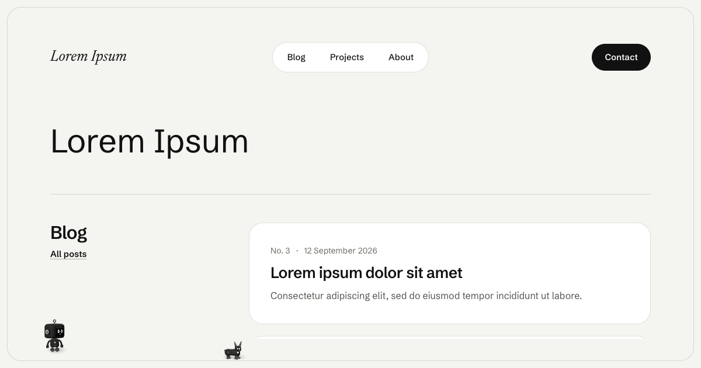
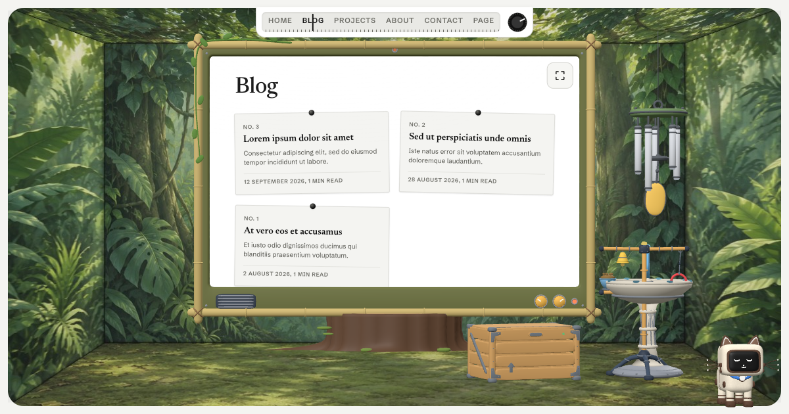

# Creatures Astro starter

A small Astro site (a blog, some projects, an about page, a way to get in touch) with toy
robots living in it. You write the words; how they're shown is a shell, and there are two.

**clean**: the site as it is, with a frame drawn round the window. Every so often
somebody turns up on the frame, walks along it, has a look at what you're reading and goes
home again. Bolt, who does the chores, comes first.
**[See it live](https://wisdomousai.github.io/creatures-astro-starter/clean/)**



**room**: the same pages, played inside a little room. They show on a monitor standing on
the floor, a tuner across the top changes the station, and each section has a room of its
own: a jungle for the blog, a lab for the projects, an office for the about page. The front page is
a lobby where four of them hold up signs for the sections, and the one you pick shows you
the way. On a phone, Bolt holds the phone up for you.
**[See it live](https://wisdomousai.github.io/creatures-astro-starter/room/)**



## Start one

```sh
npm create astro@latest -- --template wisdomousai/creatures-astro-starter/starter
```

You get the content and a config, nothing else: every word is lorem ipsum in
`src/content/`, waiting for yours. The shells come from a package, so switching between
them is one line, and a new version of the package brings its fixes without touching your
words:

```js
creatures({ shell: 'room' });
```

## What's in here

|                                                          |                                                                                                               |
| -------------------------------------------------------- | ------------------------------------------------------------------------------------------------------------- |
| [`starter/`](starter/)                                   | The starter: the content and `astro.config.mjs`. What `npm create astro` copies.                              |
| [`packages/astro-creatures/`](packages/astro-creatures/) | [`@wisdomousai/astro-creatures`](packages/astro-creatures/README.md), the Astro integration with both shells. |

The robots themselves are [`@wisdomousai/creatures`](https://github.com/wisdomousai/creatures),
a box of 149 of them, each with a spring in every joint and no recorded animation at all.

## Working on it

```sh
npm install
npm run dev                         # the starter, clean
CREATURES_SHELL=room npm run dev    # the starter, in the room
npm run check                       # types
```

The starter uses the package from `packages/` through npm workspaces, so changes to either
show up together.

## Licence

MIT, like the creatures.
